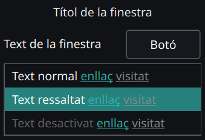
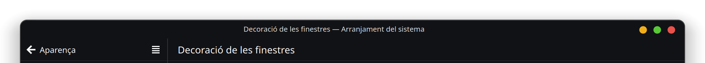

<h1 align="center">⚡ PΛLΘ's Customizations⚙️ for KDE Plasma🐧</h1>

---

## Table of Contents

- 🚧 [Installation](#-installation)
    - [Color Scheme](#color-scheme)
    - [Plasma Window Decoration](#plasma-window-decoration)
- 🏆 [Acknowledgements](#-acknowledgements)
- 📝 [Final Notes](#-final-notes)

---

## 🚧 Installation

---
  
<h3 align="center">Color Scheme</h3>

1️⃣. Move the `how2palo.colors` file to `/usr/share/color-schemes` directory.

2️⃣. Once you moved the file, go open `Colors` to apply `how2palo` (*Color Scheme*).

---

<h3 align="center">Plasma Window Decoration</h3>

1️⃣. Move the `how2palo` folder to `/usr/share/aurorae/themes/` directory.

2️⃣. Once you moved the directory, go open  `Window Decorations` to apply `how2palo` (*Plasma Window Decoration*).

---

## 🏆 Acknowledgements

---

- **`VPALO-Deco`** (*Plasma Window Decoration*): My work is based on [`vinceliuice`](https://github.com/vinceliuice/MacSonoma-kde)'s work. **Thank you** for your time and effort.

---

## 📝 Final Notes

---

- If something is missing or wrong, feel free to check the [`KDE Plasma Documentation`](https://develop.kde.org/docs/plasma/) yourself.
